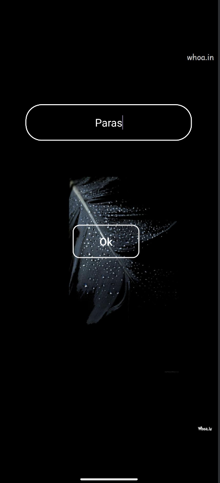

# PSMusic 🎵

**PSMusic** is a cutting-edge music application that uses the Deezer API to provide a seamless, high-quality music streaming experience. PSMusic is designed to cater to every music lover's needs.

---

## Features 🚀

- **🔍 Explore Music:** Access Deezer's vast music library for songs, albums, artists, and genres.
- **🎧 High-Quality Streaming:** Enjoy crisp and clear audio.

---

## Integration with Deezer API 💻

PSMusic integrates with Deezer's API via [RapidAPI](https://rapidapi.com/deezerdevs/api/deezer-1), allowing access to:
- **Millions of Tracks:** Browse Deezer's comprehensive music catalog.
- **Detailed Metadata:** Fetch information about tracks, albums, and artists.

---

### **Getting Started with Deezer API**

To use the Deezer API in PSMusic:
1. **Sign Up for RapidAPI:**
   - Visit [RapidAPI's Deezer API page](https://rapidapi.com/deezerdevs/api/deezer-1).
   - Sign up for an account or log in if you already have one.

2. **Subscribe to the Deezer API:**
   - On the Deezer API page, click **Subscribe**.
   - Choose the plan that suits your needs (free or paid).

3. **Obtain API Details:**
   - Once subscribed, you’ll get access to:
     - **API Key:** Your unique key for authenticating requests.
     - **Base URL:** The endpoint URL for API requests (e.g., `https://rapidapi.com/`). 
     - **Host Name:** Deezer's RapidAPI host name.

4. **Add API Details to `.env` File:**
   - Create a `.env` file in your project root directory.
   - Add the following details:
     ```sh
     API_KEY=your_api_key_here
     BASE_URL=https://api.deezer.com/
     HOST_NAME=deezerdevs.p.rapidapi.com
     ```

---

## Screenshots 📸

### Home Screen
<div style="display: flex; justify-content: space-between; align-items: center;">
  
  
  
</div>

---

## Tech Stack 🛠️

PSMusic is powered by:
- **Frontend:** Jetpack Compose, Kotlin
- **Backend:** Deezer API (via RapidAPI)
- **Networking:** Retrofit, OkHttp
- **State Management:** LiveData & ViewModel
- **Storage:** Room Database for offline data

---

## Installation 🔧

Follow these steps to install and run **PSMusic**:

1. **Clone the Repository**  
   ```sh
   git clone https://github.com/your-username/PSMusic.git
   cd PSMusic
